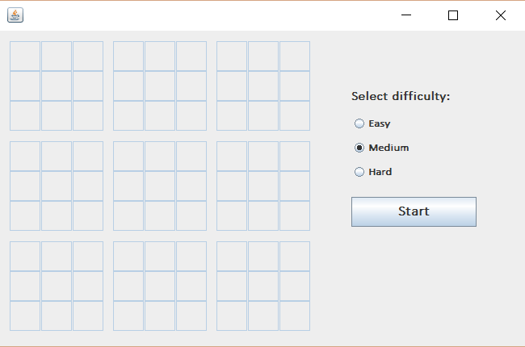
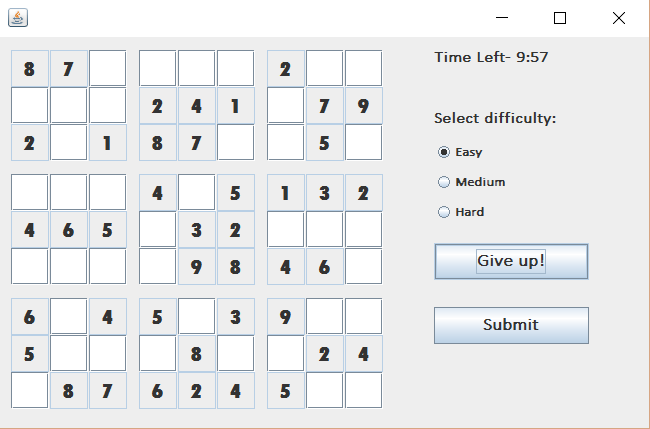

# Sudoku Game – Java GUI

This is a simple desktop Sudoku game created using Java Swing. The project includes a puzzle generator, a backtracking-based solver, and timed gameplay modes.

## 🎮 Game Features

- Sudoku generator that creates new puzzles dynamically  
- Optimized backtracking algorithm used for solving  
- Multiple difficulty levels (easy, medium, hard)  
- Timer-based gameplay  
- Swing-based GUI with interactive buttons  

## 🛠️ Technologies Used

- Java SE  
- Java Swing (AWT/Swing)  
- OOP (Object-Oriented Programming)

## 🚀 How to Run

1. Clone the repository:
    ```
    git clone https://github.com/anushkaa-jha/sudoku-game-java
    ```
2. Open the project in **Eclipse** or any Java IDE.  
3. Compile and run `Sudoku.java`.  
4. The game window will launch with puzzle and controls.

## 🖼️ Screenshots

Below are images of the game interface and gameplay:

**Game Interface**  


**Example Puzzle**  

